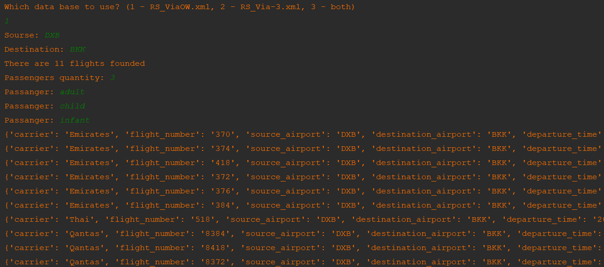

# Тестовое задание в команду ассистеда (Python/Go)

В папке два XML – это ответы на поисковые запросы, сделанные к одному из наших партнёров.
В ответах лежат варианты перелётов (тег `Flights`) со всей необходимой информацией,
чтобы отобразить билет на Aviasales.

На основе этих данных, нужно сделать вебсервис,
в котором есть эндпоинты, отвечающие на следующие запросы:

* Какие варианты перелёта из DXB в BKK мы получили?
* Самый дорогой/дешёвый, быстрый/долгий и оптимальный варианты
* В чём отличия между результатами двух запросов (изменение маршрутов/условий)?

Язык реализации: `Go`
Формат ответа: `json`
По возможности использовать стандартную библиотеку.

Язык реализации: `python3`
Формат ответа: `json`
Используемые библиотеки и инструменты — всё на твой выбор.

Оценивать будем умение выполнять задачу имея неполные данные о ней,
умение самостоятельно принимать решения и качество кода.

## Реализация
Проект позволяет найти в базе данных все рейсы между указваемыми пользователем аэропортами. 
С учётом количества пассажиров и их возростной группы формируется рейтинг рейсов по соотношению цена/время полёта. 
Проект содержит базу данных с часовыми поясами всех аэропортов мира и расчитывает время полёта с учётом различия часовых поясов.
### Как установить
Python3 должен быть уже установлен. Затем используйте `pip` (или `pip3`, если есть конфликт с Python2) для установки зависимостей:
`pip install -r requirements.txt`
При запуске проекта требуется выбрать базу данных, (работа с обеими базами данных ещё не реализованна) 
ввести аэропорт вылета, аэропорт назначения, 
количество пассажиров и их возрастную категорию - взрослый, ребёнок или младенец. 
В случае, если в базе данных отсутствует информация о ценах для детей, выведется соответствующая информация,
и в расчёте будет использоваться цена для взрослого.
### Пример запуска

### Что не удалось сделать (планируются улучшения)
- Формат ответа не json
- Принятие аргументов реализованно не через argparse
- Отсутствует сравнение баз данных
### Цель проекта
Код написан в образовательных целях на онлайн-курсе для веб-разработчиков [dvmn.org](https://dvmn.org).